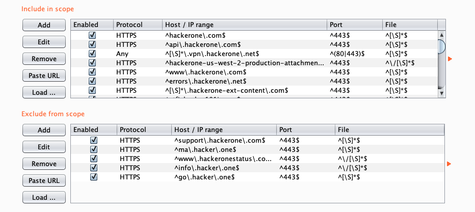

[](https://goreportcard.com/report/github.com/root4loot/rescope)
[](https://github.com/root4loot/rescope/issues)


Rescope is a cli-tool (written in Go) that aims to make life easier when defining scopes in Burp Suite and OWASP ZAP, by eliminating the many hoops one has to go through with current workflows - geared towards pentesters and bug-bounty researchers.


## How it works
1. Provide any public or private scope.
2. rescope takes care of the rest and spits out a (JSON/XML) file that is compatible with Burp/Zap.
3. Import results from Burp/Zap.

That's it! No more pulling your hair dealing with regular expressions and endlessly adding targets from the sitemap. Your scope should be ready and you are good to go.


- [Installation](#installation)
- [Features](#features)
- [Supported bugbounty platforms](#supported-bug-bounty-services-bbaas)
- [Usage](#usage)
- [Arguments](#arguments)
- [Public scopes](#public-scopes)
- [Private scopes](#private-scopes)
- [Combining Public and Private Scopes](#combining-public-and-private-scopes)
- [Importing to Burp/ZAP](#importing-results)


## ☛ Installation

Requires [Go](<https://golang.org/>) and git

```
go get -u github.com/root4loot/rescope
```

Make sure [GOPATH is set](https://github.com/golang/go/wiki/SettingGOPATH) and that go/bin is added to PATH: `export PATH=$PATH:$GOPATH/bin`


## Features

* Define public scope(s) directly from any supported BBaaS (**Bug-Bounty-as-a-Service**) platform.
* Define private scopes by copy/pasting target definitions from pretty much anywhere.
* Outputs results that is compatible with Burp Suite and Zaproxy for direct import.
* Combine private and public scopes.
* Easily separate excludes from includes.
* Parse multiple scopes to the same result.
* Supports IP-ranges & CIDR.
* Resolves conflicting includes/excludes
* Avoid resources from third party services such as github.com, github.com, itunes.apple.com, etc.


### Supported Bug-Bounty Services (BBaaS)

- [bugcrowd.com](https://bugcrowd.com)
- [hackerone.com](https://hackerone.com)
- [hackenproof.com](https://hackenproof.com)
- [intigriti.com](https://www.intigriti.com/public)
- [openbugbounty.com](https://www.openbugbounty.org)
- [yeswehack.com](https://yeswehack.com)
- [bugbounty.jp](https://bugbounty.jp)
- [federacy.com](https://www.federacy.com)

## Usage
```
usage: rescope [arguments]
```

### Arguments

| Short | Long       	| Description                   					| Required     |
| :----: |:------------:| :------------------------------------------------ | :--------    |
| -h    | --help     	| Print help information        					| Optional     |
| -b    | --burp     	| Parse to Burp Suite JSON      					| Required?    |
| -z    | --zap      	| Parse to OWASP ZAP XML        					| Required?    |
| -r    | --raw      	| Output raw in-scope definitions to outfile        | Required?    |
| -u    | --url      	| Public bug bounty program URL 					| Required     |
| -i    | --infile   	| File (scope) to be parsed     					| Required     |
| -o    | --outfile  	| File to write parsed results  					| Required     |
| -s    | --silent   	| Do not print identified targets 					| Optional     |
| -n    | --name     	| Name of ZAP context           					| Optional     |
|       | --itag     	| Custom include tag (default: !INCLUDE) 			| Optional 	   |
|       | --etag     	| Custom exclude tag (default: !EXCLUDE) 			| Optional     |
|       | --version     | Print version                 					| Optional     |


### Example Usage
Parse scopes from public bugbounty program to Burp (JSON)  
`rescope --burp -u hackerone.com/security -o burpscope.json`  

Parse scopes from public bugbounty programs to ZAP (XML)  
`rescope --zap --name CoolScope -u hackerone.com/security -o zapscope.context`

Parse scope from infile having target definitions to Burp (JSON)  
`rescope --burp -i scope.txt -o burpscope.json`

### Example Result


## Public Scopes

Defining scopes as a bugbounty researcher has never been this easy.  
(For private bugbounty scopes, see [Private Scopes](#private-scopes))

```
rescope --burp -u hackerone.com/security -o burpscope.json
```
rescope will print out a list of identified targets as seen below. Use this list to verify that it got what you wanted.  
Includes (+) are highlighted in Green, and Excludes (-) in Red.

```diff
$ rescope --burp -u hackerone.com/security -o burpscope.json
[-] Grabbing targets from hackerone.com/security 
+  https://hackerone.com
+  https://api.hackerone.com
+  *.vpn.hackerone.net
+  https://hackerone-us-west-2-production-attachments.s3-us-west-2.amazonaws.com/
+  https://www.hackerone.com
+  https://errors.hackerone.net
+  https://*.hackerone-ext-content.com
+  https://ctf.hacker101.com
+  https://*.hackerone-user-content.com/
+  66.232.20.0/23
+  206.166.248.0/23
-  https://support.hackerone.com
-  https://ma.hacker.one
-  https://www.hackeronestatus.com/
-  https://info.hacker.one/
-  https://go.hacker.one
[-] Parsing to JSON (Burp Suite)
[✓] Done. Wrote 185786 bytes to burpscope.json
```
The outputted results are ready to be [imported](#importing-results) to either Burp or Zap- depending on your choice. But before you do, make sure that you've read (and understood) the program policy ;)

Note: You are not required to remove http(s):// from the program URL prior to running.  

### Defining multiple scopes
Defining multiple scopes at once (to the same result) is only a matter of setting `-u` <url> several times.
```
rescope --zap -u hackerone.com/security -u bugcrowd.com/bugcrowd -u intigriti.com/intigriti/intigriti --name CoolScope -o zapscope.context
```

Alternatively, list them in an infile as so.
```
$ cat combined.txt
hackerone.com/security
bugcrowd.com/bugcrowd
intigriti.com/intigriti/intigriti
```
And pass this as an infile.

```
rescope --burp -i combined.txt -o burpscope.json
```

There are no restrictions here so technically you could include every public program out there in existence to create one gigantic scope but needless to say, this is not a good idea. Always read through the entire policy for a given program before proceeding to import. 


## Private Scopes

rescope is not limited to public BBaaS scopes.  
If your scope is private then list targets in a text file and pass it to `--infile` (`-i`).

Example scope:

```
$ cat scope.txt
target1.example.com
target2.example.com
target3.example.com
192.168.0.1/24
10.10.10.1-3
```

```
rescope --burp -i scope.txt -o burpscope.json
```
Defining multiple scopes at once (to the same result) is only a matter of setting `-i` <infile> several times.
```
rescope --zap -i scope1.txt -i scope2.txt --name CoolScope -o zapscope.context
```

One of the "cool" things about rescope is that it'll "automagically" detect the targets from the scope you provide- meaning they don't have to be in a specific structure/format. This allows you to simply copy/paste the scope from pretty much anywhere and provide it to rescope without the need of having to filter it out in advance.

I.e., the same scope as above, but with some leading/ending text and multiple targets on the same line.

```sh
$ cat scope.txt
High priority: target1.example.com
Medium: target2.example.com and target3.example.com
Internal: 192.168.0.1/24 (department A)
          10.10.10.1-3
```

As seen below, rescope was able to identify the targets, despite having leading text or multiple hosts on the same line. Includes (+) are highlighted in Green, and Excludes (-) in Red. Use this list to verify that it got what you wanted.

```diff
$ rescope --burp -i scope.txt -o burpscope.json
[-] Grabbing targets from scope.txt
+  target1.example.com
+  target2.example.com
+  target3.example.com
+  192.168.0.1/24
+  10.10.10.1-3
[-] Parsing to JSON (Burp Suite)
[✓] Done. Wrote 46555 bytes to burpscope.json
```

### Setting Excludes

Out-of-scope targets are set by specifying **!EXCLUDE** in the document, followed by the targets you want to exclude. Any target succeeding this tag is excluded (exclusively) from the scope. A custom exclude tag can be set with the optional `--etag` argument.

Example (scope.txt):

```
In-Scope:
target1.example.com
target2.example.com
target3.example.com

!EXCLUDE
Out-of-Scope:
target4.example.com
target5.example.com
```

If the "out-of-scope" targets happen to come _before_ the list of includes, then you must either move out-of-scope section _after_ the list of includes, or provide an **!INCLUDE** tag before the list of in-scope targets. A custom include tag can be set with the optional `--itag` argument.

Example (scope.txt):

```
!EXCLUDE
Out-of-Scope:
target4.example.com
target5.example.com

!INCLUDE  <-- required when excludes come first
In-Scope:
target1.example.com
target2.example.com
target3.example.com
```

## Combining Public and Private Scopes

Rescope is flexible in that you can define both public and private scopes to the same result.  
This is accomplished by simply combining `-u` <url> and `-i` <infile> as seen below.

```sh
rescope --burp -i scope.txt -u bugcrowd.com/bugcrowd -o burpscope.json
```

Alternatively, you can include BBaaS URL's in an infile, along with your private identifiers.  
The position at which you place these URL's does not matter.

```
$ cat scope.txt
bugcrowd.com/bugcrowd
hackerone.com/security  
intigriti.com/intigriti/intigriti  
!INCLUDE
target1.example.com
target2.example.com
!EXCLUDE
target3.example.com
```

```
$ rescope --zap --name CoolScope -i scope.txt -o zapscope.context --silent
[-] Identified BBaaS program (bugcrowd.com/bugcrowd) in scope.txt
[-] Identified BBaaS program (hackerone.com/security) in scope.txt
[-] Identified BBaaS program (intigriti.com/intigriti/intigriti) in scope.txt
[-] Grabbing targets from scope.txt
[-] Grabbing targets from bugcrowd.com/bugcrowd
[-] Grabbing targets from hackerone.com/security
[-] Grabbing targets from intigriti.com/intigriti/intigriti
[-] Parsing to XML (OWASP ZAP)
[✓] Done. Wrote 68994 bytes to zapscope.context
```


## Importing results

### Burp Suite
1. Head to **Target** 
2. Head to **Scope** 
3. Tick the **Use advanced scope control** checkbox
4. Click the ⚙︎ icon 
5. Select **Load options**
6. Choose JSON file

### OWASP ZAP
Choose **File** -> **Import Context** and select XML file.

**Note:**
- If you set `-o` filename extension to anything other than `.context` then you'll have to choose "All Format" in file select.
- For ZAP HUD; set context `--name "HUD Context"`

## Caveats

rescope cannot guarantee accurate results. For instance, a bugbounty program may opt to list targets in a non-conventional way that is not accounted for. Therefore, always verify the results yourself before importing.

## Author
* Daniel Antonsen ([root4loot](https://twitter.com/root4loot))

## License
Licensed under MIT (see license file)
